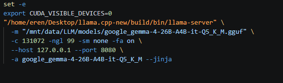
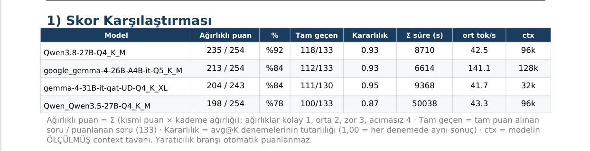
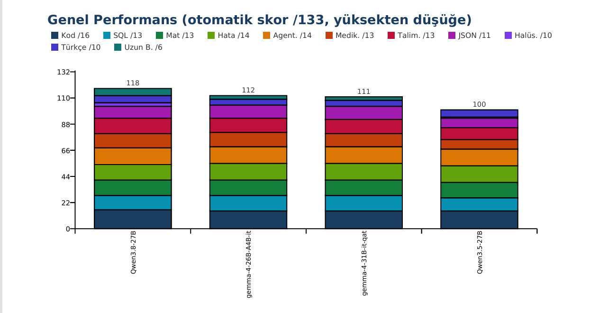
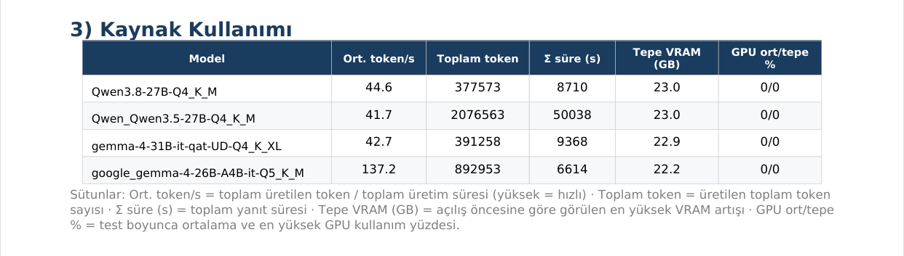

# LLM Performance Test

**Türkçe** · [English](README.en.md)

Lokal LLM'leri (llama-server / OpenAI-uyumlu `/v1` endpoint) sabit bir soru setiyle
test eder, yanıt sürelerini ve GPU kullanımını ölçer, kod/SQL/matematik cevaplarını
**otomatik puanlar** ve PDF rapor üretir.

## Hızlı başlangıç

Gereken tek yapılandırma **iki yol**: modellerin bulunduğu klasör ve `llama-server` ikilisi.

```bash
# 1) bağımlılıklar
pip install -r requirements.txt

# 2) makineye özel yolları gir (bu dosya .gitignore'dadır, depoya girmez)
cp ayarlar_yerel.ornek.py ayarlar_yerel.py
$EDITOR ayarlar_yerel.py         # LLM_MODELS_DIR ve LLAMA_SERVER

# 3) hangi modeller test edilecek: models_config.py -> MODELS listesi
#    (klasördeki .gguf dosya adlarını yaz)

# 4) çalıştır — launch/ boşsa açılış betikleri otomatik üretilir
python run_models.py
```

Yolları dosya yerine ortam değişkeniyle de verebilirsin (öncelikli):

```bash
export LLM_MODELS_DIR=/veri/modeller
export LLAMA_SERVER=~/llama.cpp/build/bin/llama-server
```

Yol eksik/yanlışsa program ne yapılacağını söyleyip durur, yarıda kalmaz.

**Kurulum doğru mu?** Model ve sunucu olmadan sınamak için:

```bash
python run_models.py --combined-selftest   # sahte veriyle tüm puanlama + PDF zinciri
python -m pytest bench/ -q                 # grader birim testleri
```

> `llama-server` bu projenin parçası değildir; [llama.cpp](https://github.com/ggml-org/llama.cpp)
> derlenip yolu gösterilir. Model `.gguf` dosyaları da ayrıca indirilir.

## Soru seti (her model için SABİT)

**12 branş, 139 soru — 133'ü otomatik puanlanır.**

| Branş | Soru | Puanlı | Nasıl puanlanır |
|---|---|---|---|
| Yaratıcılık | 6 | 0 | Hayır — insan değerlendirmesi (kriterler PDF'te) |
| Kod / algoritma | 16 | 16 | Fonksiyon çalıştırılıp sabit girdi/çıktıyla test edilir |
| SQL | 13 | 13 | SQLite'ta referans sorgu ile satır bazında kıyas |
| Matematik | 13 | 13 | `#### <sayı>` cevabı bilinen sonuçla kıyaslanır |
| Hata Ayıklama | 14 | 14 | BOZUK kod verilir; düzeltilmiş kod çalıştırılıp test edilir |
| Agentic | 14 | 14 | Çok-turlu ARAÇ kullanımı; model veriyi toplayıp çıkarım yapmalı |
| Medikal | 13 | 13 | Gerekli tıbbi terim(ler) eş anlamlılarıyla aranır |
| Talimat | 13 | 13 | Her kısıt makineyle denetlenir (madde sayısı, yasak sözcük, sıralama…) |
| JSON | 11 | 11 | Geçerli JSON (0,30) + şema uyumu (0,40) + alan değerleri (0,30) |
| Halüsinasyon | 10 | 10 | Cevaplanamaz soruda bilmediğini söylemeli; yanlış öncülü reddetmeli |
| Türkçe | 10 | 10 | Tıbbi terim yetkinliği: bozuk terimi düzelt, meşru olana DOKUNMA |
| Uzun Bağlam | 6 | 6 | Üretilen uzun belgede iğne / çelişki / sentez görevleri |

Üç branşın ayrıntısı:
- **Halüsinasyon** — (a) *cevaplanamaz*: var olmayan çalışma/protokol hakkında
  spesifik veri istenir, doğru davranış bilmediğini söylemek; (b) *yanlış öncül*:
  soru gerçek olmayan bir olayı olmuş gibi sunar, doğru davranış öncülü reddetmek.
- **Türkçe** — sorular uydurulmadı, TÜBİTAK WP6 değerlendirmesindeki **gerçek Whisper
  ASR bozulmalarından** türetildi. (a) *düzeltme*: gerçekten bozuk terim
  ("intertorakal" diye bir terim yok); (b) *dokunmama*: her iki biçim de meşru
  ("miyokart") ya da konuşma dilinin sadık dökümü ("nerden") — model dokunmamalı.
- **Uzun Bağlam** — belgeler programatik üretilir (dış veri yok, tohum sabit, her
  koşuda birebir aynı). *iğne*: tek olgu belgenin %10/%50/%90 derinliğine gömülür;
  *çelişki*: aynı olgu iki yerde farklı verilir, model yakalamalı; *sentez*: cevap üç
  ayrı bölümdeki olgunun birleştirilmesini gerektirir.

**Ağırlıklı puanlama:** her sorunun bir kademesi var — kolay ×1, orta ×2, zor ×3,
acımasız ×4. Rapordaki "ağırlıklı puan" = Σ (kısmi puan × kademe ağırlığı).
Böylece bir acımasız soruyu çözmek dört kolay soruya bedel olur.

> **JSON branşı için not:** `jsonschema` kurulu değilse şema aşaması atlanır ve o
> 0,40 puan koşulsuz verilir (koşuda uyarı basılır). `pip install -r requirements.txt`
> bunu kurar.

**Yarışma seviyesi** (LeetCode/AIME/Spider2.0 esinli — güçlü modelleri ayırt etmek için), her kategori 8 soru, kolay→çok zor:
- Kod: roman_sayi → editleme_mesafesi (Levenshtein) → kelime_bol (word break) → n_vezir (N-Queens) → en_uzun_artan_yol → **regex_eslesme (DP)** → **histogram_max_alan (stack)** → **kelime_merdiveni (BFS, word ladder)** — son 3'ü LeetCode **Hard**
- SQL (şema `calisanlar`+`satislar`): HAVING → self-join → RANK() → ROW_NUMBER top-2 → SUM() OVER kümülatif → **recursive CTE (hiyerarşi)** → **LAG (aya göre fark)** → **DENSE_RANK (2. en yüksek)**
- Matematik (AIME/olimpiyat, tek tam-sayı, `#### <sayı>` formatı): Fermat modüler → içerme-dışlama → kombinatorik → x²−y²=2025 → 1/x+1/y=1/12 → **100! sondaki sıfırlar** → **içerme-dışlama komite** → **3 zar kombinatorik**
- **Hata Ayıklama** (agentic modelin "teşhis-düzelt-doğrula" gücünü ölçer): bozuk `en_buyuk`/`carpim`/`tekrar_eden_var_mi`/`ortalama`/`fib` verilir, model düzeltir, otomatik test edilir.
- **Kod-Okuma** (read-before-act): bir kod parçasının çıktısını adım adım izleyip `#### <sayı>` ile verir.

- **Agentic** (`agentic.py` — çok-turlu araç kullanımı; modelin asıl gücünü ölçer): model araç çağırır → sandbox'ta çalıştırıp sonucu geri besleriz → çıkarım yapana kadar (tur limiti 25). 6 görev:
  - Orta: tutarsız muhasebe kaydı (invariant), 5 ipucu kesişimi (→462), çok-kaynaklı çıkarım (en çok satan→yöneticisi)
  - **Çok zor (ayırt edici):** kara kutu — gizli f(x)'i 1-6 deneyip kuralı çıkar, f(10) hesapla (tümevarım); mantık bulmacası — zebra-tarzı 4׺ehir×meslek (tümdengelim); graf en kısa yol — A→F Dijkstra (algoritmik arama)
  - Tool-calling yapamayan/yanlış çıkaran model 0 alır. (Test: agentic-v2 kara-kutu+mantık'ı geçti, graf aramada optimali kaçırıp kaldı.)

## Cevaplar nasıl "doğru/yanlış" diye değerlendiriliyor?
- **KOD:** Modelin yazdığı fonksiyon koddan çıkarılır, ayrı bir Python sürecinde
  (15 sn timeout, sonsuz döngü koruması) sabit **girdi→beklenen çıktı** çiftlerine karşı
  çalıştırılır. Tüm girdilerde doğru sonuç verirse **GEÇTİ**. (örn. `faktoriyel(5)==120`)
- **SQL:** Bellek-içi SQLite'a sabit veri yüklenir; modelin sorgusu ile **referans sorgu**
  aynı veritabanında çalıştırılır, satır sonuçları **birebir** aynıysa **GEÇTİ**
  (sütun adı önemsiz, sıralama gerektiğinde sıra da kontrol edilir).
- **MATEMATİK:** Cevaptaki sayılar ve kesirler (örn. `12/5`, `2,4`) ayrıştırılır;
  bilinen doğru sonuç tolerans dahilinde bulunursa **GEÇTİ**.
- **YARATICILIK:** Otomatik puanlanmaz; cevap PDF'e yazılır, değerlendirme kriterleri
  (özgünlük, dil, kurgu, kısıt uyumu) belirtilir.

> Doğrulama: 5 kod + 5 SQL referans çözümünün tümü grader'dan GEÇER, yanlış cevaplar
> ELENİR (oracle tutarlılığı testten geçti).

## A) Tek model testi
```bash
# modeli aç (örnek)
"$LLAMA_SERVER" -m <model.gguf> -c 32768 -ngl 99 \
  -sm none -fa on --host 127.0.0.1 --port 8080 --jinja
# test et
python llm_perf_test.py --url http://localhost:8080
```
PDF bu klasöre düşer: `rapor_<model>_<tarih>.pdf`.
Sunucusuz grader+PDF denemesi: `python llm_perf_test.py --selftest`

## B) Seçili modelleri otomatik test etme (orkestratör)
`run_models.py` her modeli **sırayla kendisi açar**, test eder, kapatır.

**HANGİ MODELLER? → SADECE `launch/` klasöründe `.sh` dosyası olanlar.**
Bir modeli testten çıkarmak için onun `open_*.sh` dosyasını `launch/` dışına taşı
(örn. yanına oluşturduğun `launch_1/` klasörüne). Geri dahil etmek için geri koy.
Kod `launch/`'ı kendiliğinden yeniden üretmez (taşıdıkların kalıcı olur).

```bash
# ÖNCE 8080'de açık llama-server OLMAMALI (betik modelleri kendi açar)
python run_models.py                       # launch/ içindeki modelleri test et
python run_models.py --gen-launchers       # TÜM modeller için launch/*.sh (yeniden) üret
python run_models.py --only gemma-3-4b-it-Q8_0.gguf   # ek filtre
python run_models.py --combined-selftest   # sahte veriyle PDF düzen testi
```
> İlk kez çalıştırırken `launch/` boşsa tüm modeller için launcher otomatik üretilir.
> Tüm seti geri istersen `--gen-launchers` (launch/ içine hepsini yeniden yazar).

**Çıktı yapısı** (her çalıştırmada YENİ, benzersiz klasör; eskiler silinmez):
```
Model_raporları/
    calisma_<tarih-saat>/                # bu çalıştırmaya özel klasör
        KARSILASTIRMA_<tarih>.pdf        # genel rapor
        model_raporlari/                 # tekli model PDF'leri (alt klasör)
            rapor_<model1>_<tarih>.pdf
            rapor_<model2>_<tarih>.pdf
            ...
```
Tek-model tester (`llm_perf_test.py`) de aynı yapıyı kullanır
(`Model_raporları/calisma_<tarih-saat>/model_raporlari/`).

- **GPU:** launcher'lar tek GPU için üretilir (`CUDA_VISIBLE_DEVICES=0`, `-sm none`, `-fa on`).
  Birden çok kart kullanacaksan `launch/open_*.sh` dosyalarını elle düzenle — kod onları
  kendiliğinden değiştirmez.
- Test edilecek modeller: **`launch/` içindeki `.sh` dosyaları** (seçim için bunları taşı).
  Model havuzu `models_config.py` -> `MODELS`, makineye özel yollar `ayarlar_yerel.py`
  (launcher'lar bu ikisinden üretilir; `launch/*.sh` depoya girmez).
- Bir model açılmazsa **durmaz**, hatayı `logs/<model>.log`'a yazıp sonrakine geçer
  (PDF'te "AÇILMADI"). Aynı model adı tekrarsa atlanır.
- `launch/open_<model>.sh` — her modeli **manuel** açmak için de kullanabilirsin.
  Üretilen betik şuna benzer:

  

  Kopyalanabilir hâli (yolları kendi kurulumuna göre doldur):

  ```bash
  set -e
  export CUDA_VISIBLE_DEVICES=0
  "$LLAMA_SERVER" \
    -m "$LLM_MODELS_DIR/google_gemma-4-26B-A4B-it-Q5_K_M.gguf" \
    -c 131072 -ngl 99 -sm none -fa on \
    --host 127.0.0.1 --port 8080 \
    -a google_gemma-4-26B-A4B-it-Q5_K_M --jinja
  ```

  `-c` değeri modelin ÖLÇÜLMÜŞ context tavanıdır (bkz. `ctx_olcum.py`), her model
  için farklıdır. `--host 127.0.0.1` yereldir; sunucu dışarıya açılmaz.

### Örnek rapor

Aşağıdakiler gerçek bir koşudan (4 model × 139 soru) alınmış sayfalardır.

**Skor karşılaştırması** — ağırlıklı puan, tam geçilen soru, kararlılık, süre,
tok/s ve modelin ÖLÇÜLMÜŞ context tavanı:



**Genel performans** — aynı skorun 12 branşa göre kırılımı; her renk bir branş,
sütunun üstündeki sayı toplam otomatik puan:



**Kaynak kullanımı** — hız ve VRAM. Buradaki fark branş skorlarından bağımsızdır:
26B-A4B (MoE) diğerlerinin üç katı hızda üretiyor:



**Birleşik PDF içeriği:**
- Üst kısım: skor karşılaştırması (ağırlıklı puan, %, tam geçen, kararlılık, süre,
  tok/s, ölçülmüş ctx) + branş bazında ağırlıklı puan + her modelin koştuğu
  parametreler + **genel performans sütun grafiği** (branş kırılımlı) + süre tablosu
- **Madde analizi:** hangi soru modelleri gerçekten ayırıyor, hangisi hiç ayrım üretmiyor
- "Sorular" bölümü: her soru + doğru cevabı (referans çözüm / beklenen sonuç)
- Alt kısım: her model ayrı sayfada, her soruya verdiği cevap kategori kategori, alt alta

## Ölçülen metrikler
- **TTFT** (ilk token süresi), **toplam süre**, **tokens/sec**, üretilen token
- **GPU/VRAM** (**GB** cinsinden): her GPU için min/ort/maks VRAM ve kullanım %; birleşik raporda tepe VRAM artışı

## Raporda kod/SQL çıktısı
Her kod sorusu için PDF'te bir tablo bulunur: **Çağrı | Beklenen çıktı | Modelin çıktısı | ✔/✘**
(modelin yazdığı fonksiyon gerçekten çalıştırılıp her girdideki çıktısı gösterilir).
SQL sorularında **beklenen sonuç** ve **modelin sorgu çıktısı** yan yana verilir.
Kod sorularında modellere "açıklama/yorum yazma, sadece kodu ver" talimatı verilir.

## Örnekleme parametreleri — iki rejim

**a) Profil rejimi (varsayılan).** Her model KENDİ model kartının önerdiği ayarla
koşar. Değerler tahmin değil, modelin `generation_config.json` dosyasından alındı
(`bench/profiles.py`):

| Model deseni | temp | top_p | top_k | rep | ek |
|---|---|---|---|---|---|
| `qwen3.8` | 1.0 | 0.95 | 20 | 1.0 | `reasoning_effort=medium` |
| `qwen3.5`–`3.7` | 0.6 | 0.95 | 20 | 1.0 | — |
| `gemma-4`, `gemma-3` | 1.0 | 0.95 | 64 | 1.0 | — |
| eşleşme yok | 0.0 | 1.0 | — | 1.1 | — |

Kural sırası önemlidir: ilk eşleşen kazanır, bu yüzden `qwen3.8` kuralı
`qwen3.[567]`'den önce gelir. Yeni model için bu listeye desen eklemek yeterli.

Bu rejimde sonuç "aynı koşulda hangisi iyi" değil, **"her biri en iyi hâliyle ne
yapabiliyor"** sorusunu yanıtlar. Raporun 1b tablosu her modelin parametresini yazar.

**b) `--deterministik`.** Profilleri yok sayar, hepsini `temperature=0` ile koşar —
karşılaştırılabilir taban isteyenler için.

> `run_models.py`'nin `--temperature` / `--repeat-penalty` bayrakları profil rejiminde
> ETKİSİZDİR: istek gövdesi önce bu değerlerle kurulur, hemen ardından profilin
> değerleriyle üzerine yazılır. Sıcaklığı gerçekten değiştirmek için ya
> `bench/profiles.py`'yi düzenle ya da `--deterministik` kullan.

### Diğer parametreler
| Argüman | Varsayılan | Açıklama |
|---------|-----------|----------|
| `--max-tokens` | `0` (otomatik) | 0 = bağlamın izin verdiği en yüksek değer (`n_ctx - 2048`) |
| `--tekrar K` | `1` | Her puanlı soru K kez sorulur, puan ortalanır (avg@K) |
| `--no-think` | kapalı | Düşünmeyi (reasoning) kapat (`enable_thinking=false`) |
| `--gpu-interval` | `0.5` | GPU örnekleme aralığı (sn) |
| `--load-timeout` | `300` | (orkestratör) model yüklenme bekleme süresi |

## Reasoning (düşünen) modeller — neden boş cevap olur?
Qwen3 gibi modeller önce `reasoning_content` üretir, sonra nihai cevaba (`content`) geçer.
`max_tokens` düşükse model **düşünürken** limite takılır (`finish_reason=length`) ve nihai
cevabı hiç yazamaz → rapor boş görünür. Çözümler:
- `max_tokens` varsayılan olarak OTOMATİK: `n_ctx - 2048` (32k bağlamda ~30720),
  böylece model düşünüp cevaplayacak yeri bulur.
- `--no-think` ile düşünmeyi kapat: model doğrudan cevap verir (daha hızlı, garanti cevap).
- Cevap yine boşsa rapor **nedenini** yazar (token limiti / düşünme aşaması) ve elde varsa
  düşünme içeriğinin bir kısmını gösterir — artık sessizce boş kalmaz.

## Not
Süre/UTF-8 kodlaması ve grader'lar gerçek modelle uçtan uca doğrulandı
(`python -m pytest bench/ -q`). Tam tur (tüm modeller × 139 soru) modellerin
boyutuna ve düşünme kipine göre saatler sürebilir; `--only` ile daraltılabilir.
